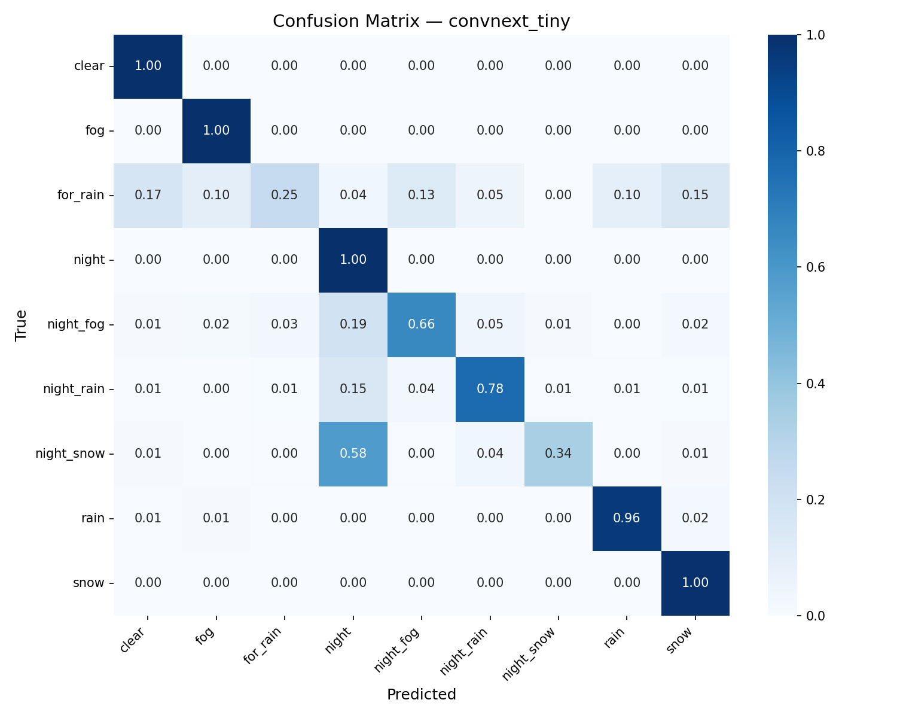
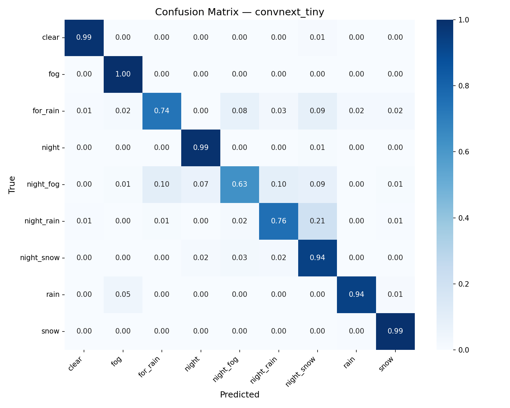
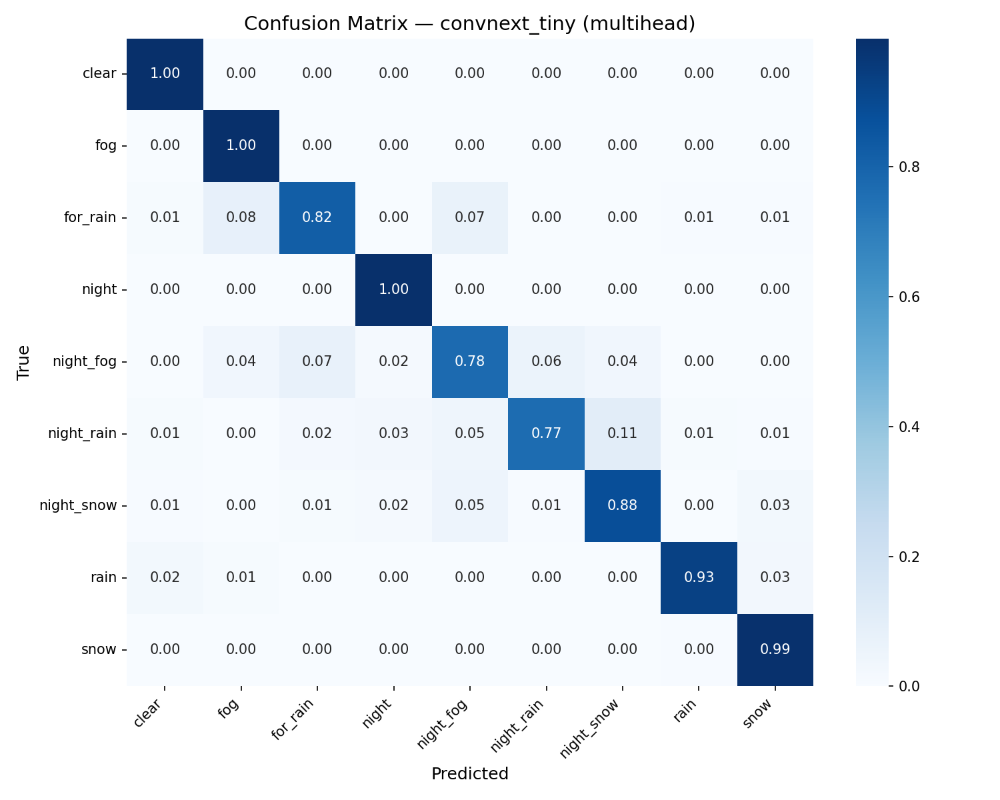

**Baseline** \
Model: ConvNeXt-Tiny \
Accuracy: 0.85998 \
F1 score: 0.7642 \
Dataset: v1 (9 classes) \
Comment: Первый запуск на сыром датасете v1. Низкое качество объясняется шумными метками и неоднородным распределением классов. Выявлена необходимость чистки и балансировки данных.

**Baseline dataset v2** \
Model: ConvNeXt-Tiny \
Accuracy: 0.9301 \
F1 score: 0.8867 \
Dataset: v2 (9 classes) \
Comment: Переход на датасет v2 (дочищенные метки, исправлен баланс классов через `WeightedRandomSampler`) дал прирост +7.0% accuracy и +12.3% F1. Архитектура не менялась — весь прирост за счёт данных.

**Multihead** \
Model: ConvNeXt-Tiny \
Accuracy: 0.9407 \
F1 score: 0.9044 \
Dataset: v2 (9 classes) \
Comment: Заменили одноголовый классификатор на двухголовый: `head_dn` (день/ночь) + `head_wt` (тип погоды). Итоговый класс — декартово произведение softmax двух голов через `COMBO_TO_FINAL`. Прирост +1.1% accuracy, +1.8% F1 — особенно снизилась путаница между `night` и ночными классами.

**Focal loss + Multihead** \
Model: ConvNeXt-Tiny \
Accuracy: 0.9471 \
F1 score: 0.9167 \
Dataset: v2 (9 classes) \
Comment: Заменили CrossEntropy на Focal Loss (γ=2.0). Лосс считается отдельно по каждой голове и суммируется: `L = FL(logits_dn, y_dn) + FL(logits_wt, y_wt)`. Прирост +0.64% accuracy, +1.23% F1. Наиболее заметное улучшение по классам `night_fog` и `night_rain` — редкие и сложные примеры получили больший вес в обучении.

**Focal loss γ=3.0** \
Model: ConvNeXt-Tiny \
Accuracy: 0.9430 \
F1 score: 0.9130 \
Dataset: v2 (9 classes) \
Comment: Попытка усилить акцент на трудных примерах. Обучение нестабильно на первых эпохах, финальный результат хуже γ=2.0 на 0.4% F1. Оптимальное значение — γ=2.0.

**ConvNeXt-Small Multihead** \
Model: ConvNeXt-Small \
Accuracy: 0.9360 \
F1 score: 0.9050 \
Dataset: v2 (9 classes) \
Comment: Более крупный backbone не дал улучшения — датасет (~4000 изображений) недостаточен для эффективного использования ConvNeXt-Small. Чекпоинт 594 MB против 334 MB у Tiny при худшем качестве. Ветка закрыта.

**TTA (6 passes)** \
Model: ConvNeXt-Tiny Multihead + Focal Loss \
Accuracy: 0.9490 \
F1 score: 0.9180 \
Dataset: v2 (9 classes) \
Comment: Test-Time Augmentation: оригинал + hflip + brightness + blur + affine + gamma. Вероятности усредняются по 6 проходам. Прирост +0.2% F1 при 6× увеличении latency. В продакшн-API не включён — для онлайн-инференса используется student-модель.

---

